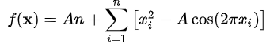
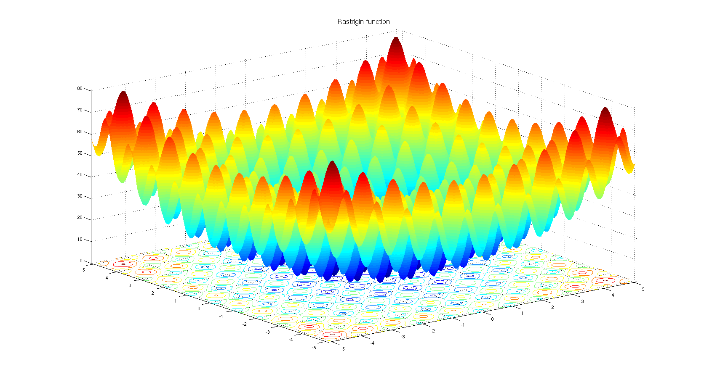
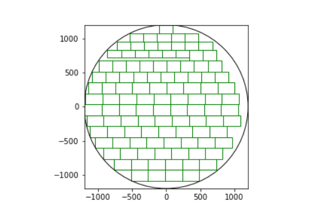

# Implementation of evolution algorithms for 3 different cases from scratch

### Description of the project

Project was realised during Computional Inteligence course and the goal was to implement solutions of 3 cases using evolutional algorithms. 

#### `Case 1`

First case was to implement solution to minimalise 5 dimensional Rastrigin function. Rastrigin function is a non-convex function often used as a performance test problem for optimization algorithms. Solutions of this case is located inside **rastrigin_minimalisation** catalog.

The equation of n dimensional domain:

and visualization:

#### `Case 2`

Second case was to implement solution for cutting stock problem. Probles was defined as to maximize score while filling circle with rectangles with specified height, length and assigned value to each type of rectangle. Solution of this case is located inside **cutting_stock_problem** catalog. Inside you can find `cutting` catalog where are diffrent csv files to test implemented solution. Each file contains specified dimensions and values of rectangles and goal was to maximize score on each csv file.

Visualization of the problem:

In the algorithm.py is implementation of the standard evolutional algorithm. The logic specified for this task is implemented inside cuttingStock.py where you can find functions like fitness function, functions for arranging rectangles in a circle and much more. To see usage and for easier understanding I strongly suggest to check out AE2.ipynb where tests and visualizations of the algorithm are carried out.

#### `Case 3`

Third case was to implement solution for tuning neural network's weights and biases. The goal was to obtain reasonable results without  running backpropagation, relying only on evolutional algorithm run. Implementation of this algorithm can be found in mlp.py file. Important note is that here I am using my own implementation of multilayer perceptron which can be found inside **network_package** catalog. This has been implemented also during Computional Inteligence class and is avaible on my github (for more see: https://github.com/Szymon-Gut/MLP).

All results can be found in AE3.ipynb and I strongly recommend to take a look here for better understanding of my solution and to see visualizations showing the effects of the experiments which were carried out.

*Project done during Methods of Computional Inteligence class at Warsaw University Of Technology*
